# Crescat Entitlement System -- Architecture Proposal

**Version:** 1.0
**Date:** 2026-02-11
**Status:** Proposal
**Authors:** Architecture Team
**Audience:** Engineering, Product, and Operations stakeholders

---

## Table of Contents

1. [Vision and Principles](#1-vision-and-principles)
2. [Glossary](#2-glossary)
3. [Data Model](#3-data-model)
4. [Entity Relationship Diagram](#4-entity-relationship-diagram)
5. [Item Type Behaviors (State Machines)](#5-item-type-behaviors-state-machines)
6. [Rule Engine Design](#6-rule-engine-design)
7. [Key Workflows](#7-key-workflows)
8. [Scanning Architecture](#8-scanning-architecture)
9. [API Design](#9-api-design)
10. [Migration Strategy](#10-migration-strategy)
11. [What This Enables](#11-what-this-enables)

---

## 1. Vision and Principles

### The Problem

Crescat's current accreditation system is a single-purpose polymorphic model: a person is linked to a festival with an accreditation level, and a timestamp records when it was collected. This architecture cannot express the operational reality of modern festivals, where the same person may need zone access, meal vouchers, equipment loans, and shift-based entitlements -- all tracked, enforced, and auditable through a unified scanning infrastructure.

### The Opportunity

Research into 11 accreditation and credential management systems -- from Accredit Solutions and Gallagher Security to FestivalPro, Lennd, and Arkon -- reveals that **no existing system unifies access control, consumable tracking, returnable item lifecycle, and shift-linked entitlements into a single coherent model**. Event platforms handle workflows well but lack architectural sophistication. Access control companies have mature permission models but no concept of consumables or events. The industry gap is the same gap Crescat needs to fill.

### Design Philosophy

This proposal synthesizes the best patterns from all 11 researched systems into one architecture, guided by five principles:

**1. Person-centric model with credential as delivery mechanism.**
The Participant (person-event junction) is the operational center of gravity. Credentials (badges, QR codes, wristbands) are physical or digital tokens that resolve to a Participant at scan time. Entitlements belong to the Participant, not the credential. This follows Accredit Solutions' Registration pattern and Gallagher's Cardholder model, avoiding the credential-centric trap of systems like CoreGo and Axess where replacing a wristband means re-assigning permissions.

**2. Unified entitlement types with type-specific state machines.**
A single `Entitlement` entity handles access passes, meal vouchers, equipment loans, and one-time perks. The `item_type` field on the `EntitlementItem` determines the state machine and quantity behavior. This is Arkon's "tilvalg" polymorphic concept, elevated with FestivalPro's scan-limit mechanics and Gallagher's temporal layering.

**3. Rule engine for automated assignment with manual override.**
Rules are first-class entities that connect criteria (who) to items (what) with quantities (how much) and schedules (when). When a participant is added, shifts change, or rules are modified, the engine evaluates and creates or adjusts entitlements automatically. Manual overrides are preserved and clearly flagged. This fills the single largest gap identified across all 11 systems -- no event platform has a true rule engine.

**4. Multi-purpose, offline-first scanning.**
A single scan of a credential resolves the participant and shows all active entitlements. The checkpoint configuration determines which items to check or dispense. Offline mode pre-computes validation data and syncs when connected. This combines FestivalPro's polymorphic eTicket scanning, Accredit Solutions' bulk-download offline strategy, and Arkon's color-coded visual feedback.

**5. API-first with comprehensive webhooks.**
Every operation is available through a REST API. Lifecycle events emit webhooks. Only 3 of 11 researched systems have a public API; this is table stakes for ecosystem growth and a clear differentiator.

### What This Replaces

| Current System | New System |
|---|---|
| `Accreditation` model (polymorphic) | `Entitlement` with `item_type: access` |
| `AccreditationLevel` | `EntitlementItem` (type: access) with zone associations |
| `AccreditationList` (implied) | `EntitlementRule` with criteria |
| Manual meal tracking (none) | `Entitlement` with `item_type: consumable` + scan-based decrement |
| No equipment tracking | `Entitlement` with `item_type: returnable` + checkout/return lifecycle |
| No shift-linked entitlements | `EntitlementRule` with `criteria_type: shift_hours` |

---

## 2. Glossary

Every term in this document has a precise definition. Ambiguity in terminology was the single most common source of confusion across the 11 researched systems.

### Core Entities

| Term | Definition |
|---|---|
| **Participant** | The junction entity connecting a person to a festival. Replaces the concept previously called "FestivalContributor." Polymorphic: the `participant_type` and `participant_id` fields point to one of four existing Crescat models (User, PartnerContact, Guest, PublicFormResponder). Each person has one Participant record per festival, regardless of how many roles or connections they have. Inspired by Accredit Solutions' Registration entity (Contact + Event + Role + Organisation) but adapted to Crescat's existing polymorphic person models. Carries a UUID for credential generation. Optional `affiliation` and `role` text fields allow display overrides without changing the underlying model relationships. |
| **EntitlementCategory** | A named grouping of EntitlementItems within a festival. Used to organize the admin UI and structure scanning checkpoints. Examples: "Accreditations," "Meals," "Equipment," "Supplies," "Perks." Has a sort order for display. Inspired by Arkon's grouping of tilvalg by type. |
| **EntitlementItem** | A specific thing that can be assigned to a participant. Defined at the festival level. Examples: "AAA-Access Pass," "Lunch Voucher," "Two-Way Radio," "Volunteer T-Shirt (M)." Each item has an `item_type` that determines its behavioral state machine. The item_type enum has four values: `access` (zone-based, unlimited use within validity), `consumable` (quantity-limited, decremented on each use), `returnable` (checked out and must be returned), `one_time` (single collection, then done). Items may optionally track total inventory and may be flagged as `per_day` to reset quantities daily. |
| **Entitlement** | The assignment of a specific EntitlementItem to a specific Participant, with quantity and validity configuration. This is the central operational entity. An entitlement has a status that follows the state machine defined by its item's type. It may be created by a rule (with `entitlement_rule_id` set) or manually (rule_id null). The `rule_overridden` boolean flag preserves manual edits when rules are re-evaluated. |
| **EntitlementTransaction** | An immutable record of every use, return, or scan of an entitlement. The `modifier` field is +1 (consumption/use), -1 (return/undo), or 0 (verification-only scan). Transactions are the audit trail and the source of truth for "how many has this person used." Inspired by Arkon's scan-based voucher decrement model and Lennd's undo capability. |

### Rule Engine

| Term | Definition |
|---|---|
| **EntitlementRule** | An automation that connects targeting criteria to an EntitlementItem with a quantity. When criteria match a participant, the system creates an Entitlement automatically. Rules have a priority (for ordering), stacking behavior (how to handle conflicts with other rules granting the same item), and an optional schedule. Rules are the implementation of what Accredit Solutions calls the "Matrix" -- the mapping from roles/groups to default entitlements. |
| **EntitlementRuleCriteria** | A single condition within a rule, defining WHO the rule targets. The `criteria_type` enum specifies the matching logic: `all_crew` (all Users on the festival), `all_responders` (all PublicFormResponders), `all_festival_members` (all crew + responders), `all_travel_party` (all PartnerContacts on performances), `all_guests` (all Guests on guest lists), `festival_section` (members of a specific FestivalSection), `role` (users with a specific role), `public_form` (accepted responders of a specific form), `shift_hours` (participants with shifts meeting hour thresholds). Polymorphic criteria use `criteria_model_type` and `criteria_model_id` to point to the specific section, role, or form. Shift-hours criteria use `min_shift_hours` and `max_shift_hours` for range matching. |
| **EntitlementSchedule** | A temporal validity window that can be attached to rules or individual entitlements. Defines date ranges (`valid_from`, `valid_to`), days of week (JSON array of weekday numbers, 0=Sunday through 6=Saturday), and optional time-of-day windows (`valid_time_from`, `valid_time_to`). Inspired by Gallagher's Schedule + Day Category temporal layering, simplified for the event context. |

### Zones and Access

| Term | Definition |
|---|---|
| **Zone** | A physical area within a festival site that has controlled access. Zones can be hierarchical (a parent zone contains child zones -- e.g., "Backstage" contains "Green Room" and "Production Office"). Access to a parent zone implies access to all child zones. Zones may have a capacity limit. Inspired by Gallagher's Access Zone hierarchy and Eventree's Area > Sub-area model. |

### Credentials and Scanning

| Term | Definition |
|---|---|
| **Credential** | A physical or digital token that identifies a Participant at scan time. The `credential_type` enum supports `qr` (default, generated for all participants), `badge` (printed laminate), `wristband` (physical with printed/encoded identifier), and `nfc` (NFC/RFID chip). A participant may have multiple credentials (e.g., a QR code in their email and a printed badge). The credential's `identifier` field is a UUID or barcode string that scanning devices look up. Credentials have status: `active`, `suspended`, `revoked`, `lost`. Inspired by Gallagher's Card entity and Accredit's Badge, with the important design choice that entitlements belong to the Participant, not the credential -- replacing a lost badge does not require re-assigning permissions. |
| **Checkpoint** | A scanning station configured at the festival site. Each checkpoint has a type: `gate` (access control for a zone), `dispenser` (gives out consumables/returnables), `scanner` (general verification). Checkpoints are associated with a zone (for gates) and configured with which EntitlementItems they check or dispense. A single physical device can serve as multiple checkpoint types. Inspired by FestivalPro's multi-purpose scanner and Arkon's combined access/voucher/shift scanning. |
| **CheckpointScan** | An immutable log entry recording every scan at a checkpoint. Records the checkpoint, credential, resolved participant, scan type (access_in, access_out, dispense, return, verify), result (granted, denied, error), and denial reason if applicable. This is the operational audit trail for on-site activity. |

### Group Allocation

| Term | Definition |
|---|---|
| **EntitlementAllocation** | A bulk quantity of an EntitlementItem assigned to an organizational unit (Performance, PartnerCompany, or FestivalSection) for distribution to individual participants. The allocation tracks total quantity, distributed count, and remaining count. Group leaders can distribute from the allocation to named individuals, creating individual Entitlements that flow through the normal lifecycle. Inspired by Lennd's Allocation + Guest List pattern and Axess' Flex Days shared pool model. |

---

## 3. Data Model

This section defines every table, its columns, types, constraints, and the rationale behind each design decision. All tables use Laravel conventions (auto-incrementing `id`, `created_at`, `updated_at`, `deleted_at` for soft deletes).

### 3.1 Core Entities

#### `participants`

The operational junction between a person and a festival. Every person interacting with the entitlement system must have a Participant record.

| Column | Type | Nullable | Default | Description |
|---|---|---|---|---|
| `id` | bigint | no | auto | Primary key |
| `uuid` | uuid | no | generated | Public identifier for credentials and scanning |
| `festival_id` | bigint FK | no | | References `festivals.id` |
| `participant_type` | string | no | | Polymorphic type: `App\Models\User`, `App\Models\PartnerContact`, `App\Models\Guest`, `App\Models\PublicFormResponder` |
| `participant_id` | bigint | no | | Polymorphic ID referencing the specific person model |
| `affiliation` | string | yes | null | Display override for organization/affiliation text |
| `role` | string | yes | null | Display override for role/title text |
| `created_at` | timestamp | no | | |
| `updated_at` | timestamp | no | | |
| `deleted_at` | timestamp | yes | null | Soft delete |

**Indexes:** `unique(festival_id, participant_type, participant_id)`, `index(uuid)`, `index(festival_id)`

**Design rationale:** The unique constraint on (festival_id, participant_type, participant_id) ensures one Participant per person per festival. The UUID is the scannable identifier -- it appears on QR codes and badges. The `affiliation` and `role` text fields allow overriding what is displayed on badges and scanning screens without changing the underlying model relationships, addressing the question raised in Crescat's original planning doc. The polymorphic approach reuses Crescat's existing four person models rather than creating a new unified person table.

#### `entitlement_categories`

Groupings for organizing EntitlementItems in the admin UI.

| Column | Type | Nullable | Default | Description |
|---|---|---|---|---|
| `id` | bigint | no | auto | Primary key |
| `festival_id` | bigint FK | no | | References `festivals.id` |
| `name` | string | no | | Category name (e.g., "Accreditations," "Meals") |
| `description` | text | yes | null | Optional description |
| `sort_order` | integer | no | 0 | Display ordering |
| `created_at` | timestamp | no | | |
| `updated_at` | timestamp | no | | |

**Indexes:** `index(festival_id)`, `unique(festival_id, name)`

**Design rationale:** Categories are purely organizational. They do not affect behavior -- that is determined by the `item_type` on EntitlementItem. This separation means "Meals" category can contain both consumable items (lunch voucher) and access items (all-day cafeteria access) if needed.

#### `entitlement_items`

The catalog of things that can be assigned to participants.

| Column | Type | Nullable | Default | Description |
|---|---|---|---|---|
| `id` | bigint | no | auto | Primary key |
| `festival_id` | bigint FK | no | | References `festivals.id` |
| `entitlement_category_id` | bigint FK | no | | References `entitlement_categories.id` |
| `name` | string | no | | Item name (e.g., "AAA-Access," "Lunch Voucher," "Two-Way Radio") |
| `item_type` | enum | no | | One of: `access`, `consumable`, `returnable`, `one_time` |
| `total_inventory` | integer | yes | null | Total available quantity across the festival. Null = unlimited. Used for returnables and supply-limited items. |
| `per_day` | boolean | no | false | If true, quantities reset daily (for consumables like "3 meals per day") |
| `description` | text | yes | null | Optional description shown to participants |
| `uuid` | uuid | no | generated | Stable identifier for offline scanning data |
| `created_at` | timestamp | no | | |
| `updated_at` | timestamp | no | | |
| `deleted_at` | timestamp | yes | null | Soft delete |

**Indexes:** `index(festival_id)`, `index(entitlement_category_id)`

**Design rationale:** The `item_type` enum is the architectural key -- it determines the state machine, scanning behavior, and quantity semantics. The `total_inventory` field enables equipment tracking ("we have 50 radios") without forcing inventory management on items that don't need it. The `per_day` flag addresses the common festival requirement of daily meal allowances versus festival-period equipment loans. The UUID is included for offline scanning -- scanners cache item UUIDs to validate without network access.

#### `entitlements`

The assignment of an item to a participant. This is the central operational table.

| Column | Type | Nullable | Default | Description |
|---|---|---|---|---|
| `id` | bigint | no | auto | Primary key |
| `participant_id` | bigint FK | no | | References `participants.id` |
| `entitlement_item_id` | bigint FK | no | | References `entitlement_items.id` |
| `entitlement_rule_id` | bigint FK | yes | null | References `entitlement_rules.id` if created by a rule. Null if manually assigned. |
| `quantity` | integer | yes | null | How many uses/units. Null = unlimited. For access type, always null. |
| `status` | enum | no | `assigned` | Current state. Values depend on item_type (see Section 5). Core values: `assigned`, `collected`, `active`, `depleted`, `expired`, `returned`, `revoked` |
| `entitlement_schedule_id` | bigint FK | yes | null | References `entitlement_schedules.id` for time-windowed validity |
| `valid_from` | datetime | yes | null | Start of validity period. Null = valid immediately. |
| `valid_to` | datetime | yes | null | End of validity period. Null = valid until festival ends. |
| `rule_overridden` | boolean | no | false | True if manually modified after rule creation. Prevents rule re-evaluation from overwriting. |
| `notes` | text | yes | null | Admin notes |
| `created_at` | timestamp | no | | |
| `updated_at` | timestamp | no | | |
| `deleted_at` | timestamp | yes | null | Soft delete |

**Indexes:** `index(participant_id)`, `index(entitlement_item_id)`, `index(entitlement_rule_id)`, `index(status)`

**Design rationale:** The nullable `quantity` field uses null-as-unlimited, which is cleaner than a magic number. The `rule_overridden` flag is critical for the rule engine -- it answers the question "when I re-evaluate rules, should I touch this entitlement?" that Crescat's original doc identified. The `status` enum is intentionally broader than any single item_type needs; each item_type uses a subset (see Section 5). This avoids separate tables per type while keeping a single queryable status field.

#### `entitlement_transactions`

Immutable audit log of every interaction with an entitlement.

| Column | Type | Nullable | Default | Description |
|---|---|---|---|---|
| `id` | bigint | no | auto | Primary key |
| `entitlement_id` | bigint FK | no | | References `entitlements.id` |
| `checkpoint_id` | bigint FK | yes | null | References `checkpoints.id`. Null for admin actions (manual assignment, revocation). |
| `modifier` | smallint | no | | +1 = use/dispense, -1 = return/undo, 0 = verification only |
| `scanned_by_id` | bigint FK | yes | null | References `users.id` (the operator performing the scan) |
| `timestamp` | datetime | no | | When the transaction occurred |
| `notes` | text | yes | null | Optional notes (e.g., "damaged on return," "collected 3 for band") |
| `created_at` | timestamp | no | | |

**Indexes:** `index(entitlement_id)`, `index(checkpoint_id)`, `index(timestamp)`

**Design rationale:** Transactions are append-only -- they are never updated or deleted. The current usage count for any entitlement is computed as `SUM(modifier) WHERE entitlement_id = X`. This is more robust than a counter field because it supports undo (Lennd's catering app pattern), concurrent scanning, and complete audit trails. The `modifier` approach (inspired by Arkon's +1/-1 model) handles all cases: consuming a meal (+1), returning a radio (-1), and verifying access without affecting quantity (0).

### 3.2 Rule Engine

#### `entitlement_rules`

Automation rules that create entitlements when criteria are met.

| Column | Type | Nullable | Default | Description |
|---|---|---|---|---|
| `id` | bigint | no | auto | Primary key |
| `festival_id` | bigint FK | no | | References `festivals.id` |
| `entitlement_item_id` | bigint FK | no | | References `entitlement_items.id` -- the item this rule grants |
| `name` | string | no | | Human-readable rule name (e.g., "Crew meal allowance") |
| `quantity` | integer | yes | null | How many to grant. Null = unlimited (for access items). |
| `priority` | integer | no | 0 | Evaluation order. Higher priority rules are evaluated later and can override. |
| `is_active` | boolean | no | true | Whether this rule is currently active |
| `per_day` | boolean | no | false | If true, quantity is per day rather than total |
| `stacking_behavior` | enum | no | `stack` | How this rule interacts with other rules granting the same item to the same participant. Values: `stack` (quantities add up), `replace` (this rule's quantity replaces), `highest` (keep the highest quantity from any rule) |
| `entitlement_schedule_id` | bigint FK | yes | null | References `entitlement_schedules.id` for time-restricted grants |
| `created_at` | timestamp | no | | |
| `updated_at` | timestamp | no | | |
| `deleted_at` | timestamp | yes | null | Soft delete |

**Indexes:** `index(festival_id)`, `index(entitlement_item_id)`, `index(is_active)`

**Design rationale:** The stacking_behavior enum addresses the most poorly-solved problem across all 11 researched systems. Only Eventree has an explicit deduplication rule (one pass per category per person) and Gallagher composes additively (union of permissions). Making this configurable per-rule gives festival organizers control: meal rules might stack (two roles = more meals), while access rules should use highest (multiple sources of backstage access should not create duplicate passes). The `per_day` flag on the rule, combined with `per_day` on the item, enables daily reset semantics.

#### `entitlement_rule_criteria`

Individual conditions within a rule. A rule can have multiple criteria; a participant must match ALL criteria for the rule to apply (AND logic).

| Column | Type | Nullable | Default | Description |
|---|---|---|---|---|
| `id` | bigint | no | auto | Primary key |
| `entitlement_rule_id` | bigint FK | no | | References `entitlement_rules.id` |
| `criteria_type` | enum | no | | One of: `all_crew`, `all_responders`, `all_festival_members`, `all_travel_party`, `all_guests`, `festival_section`, `role`, `public_form`, `shift_hours` |
| `criteria_model_type` | string | yes | null | Polymorphic type for specific criteria (e.g., `App\Models\FestivalSection`, `App\Models\Role`) |
| `criteria_model_id` | bigint | yes | null | Polymorphic ID for specific criteria |
| `min_shift_hours` | decimal(5,2) | yes | null | For `shift_hours` type: minimum hours in a day to qualify |
| `max_shift_hours` | decimal(5,2) | yes | null | For `shift_hours` type: maximum hours (for tiered rules) |
| `created_at` | timestamp | no | | |
| `updated_at` | timestamp | no | | |

**Indexes:** `index(entitlement_rule_id)`, `index(criteria_type)`

**Design rationale:** The criteria system uses a hybrid approach: simple boolean criteria (`all_crew`, `all_guests`) are enum values that require no additional data, while scoped criteria (`festival_section`, `role`, `public_form`) use polymorphic references to point to specific models. The `shift_hours` criteria type with min/max range enables the tiered meal allocation that Crescat's original doc describes ("4 hours = 1 meal, 6 hours = 2 meals, 10 hours = 3 meals") as separate rules with different hour ranges and quantities. This is the feature that no researched system implements.

#### `entitlement_schedules`

Temporal validity windows reusable across rules and entitlements.

| Column | Type | Nullable | Default | Description |
|---|---|---|---|---|
| `id` | bigint | no | auto | Primary key |
| `festival_id` | bigint FK | no | | References `festivals.id` |
| `name` | string | no | | Human-readable name (e.g., "Festival Weekend," "Night Shift Hours") |
| `valid_from` | date | yes | null | Start date. Null = from festival start. |
| `valid_to` | date | yes | null | End date. Null = until festival end. |
| `valid_days` | json | yes | null | Array of weekday numbers (0=Sun, 1=Mon, ..., 6=Sat). Null = all days. |
| `valid_time_from` | time | yes | null | Start time of day. Null = midnight (00:00). |
| `valid_time_to` | time | yes | null | End time of day. Null = end of day (23:59). |
| `created_at` | timestamp | no | | |
| `updated_at` | timestamp | no | | |

**Indexes:** `index(festival_id)`

**Design rationale:** Schedules are inspired by Gallagher's temporal layering (Schedule + Day Category) but simplified for the event context. Gallagher's system supports six schedule types and calendar-based day classification; festivals need date ranges, day-of-week filtering, and time windows. The JSON `valid_days` array is pragmatic -- festivals rarely need complex recurring patterns. A schedule can be shared across multiple rules (e.g., "Weekend Schedule" used by both meal rules and access rules).

### 3.3 Zones and Access

#### `zones`

Physical areas within the festival site.

| Column | Type | Nullable | Default | Description |
|---|---|---|---|---|
| `id` | bigint | no | auto | Primary key |
| `festival_id` | bigint FK | no | | References `festivals.id` |
| `name` | string | no | | Zone name (e.g., "Backstage," "VIP," "Production Office") |
| `description` | text | yes | null | Optional description |
| `parent_zone_id` | bigint FK | yes | null | Self-referential for hierarchy. Null = top-level zone. |
| `capacity` | integer | yes | null | Maximum occupancy. Null = unlimited. |
| `created_at` | timestamp | no | | |
| `updated_at` | timestamp | no | | |

**Indexes:** `index(festival_id)`, `index(parent_zone_id)`

**Design rationale:** Hierarchical zones enable "access to Backstage implies access to Green Room" without redundant assignments. Gallagher's zone hierarchy is the most mature model for this. Capacity tracking enables real-time occupancy counting through directional scanning (in/out), which CoreGo implements and Accredit Solutions supports at their Area level.

#### `entitlement_item_zone` (pivot)

Maps which EntitlementItems grant access to which Zones.

| Column | Type | Nullable | Default | Description |
|---|---|---|---|---|
| `id` | bigint | no | auto | Primary key |
| `entitlement_item_id` | bigint FK | no | | References `entitlement_items.id` |
| `zone_id` | bigint FK | no | | References `zones.id` |

**Indexes:** `unique(entitlement_item_id, zone_id)`

**Design rationale:** This many-to-many relationship means one access pass can grant entry to multiple zones, and one zone can be accessible via multiple pass types. This matches Accredit Solutions' Badge Access model (named access rights linked to Areas) and Gallagher's Access Group model (groups linked to Access Zones).

### 3.4 Credentials and Scanning

#### `credentials`

Physical or digital tokens linked to participants.

| Column | Type | Nullable | Default | Description |
|---|---|---|---|---|
| `id` | bigint | no | auto | Primary key |
| `participant_id` | bigint FK | no | | References `participants.id` |
| `credential_type` | enum | no | `qr` | One of: `qr`, `badge`, `wristband`, `nfc` |
| `identifier` | string | no | | The scannable value (UUID, barcode, NFC UID). Unique across all credentials. |
| `status` | enum | no | `active` | One of: `active`, `suspended`, `revoked`, `lost` |
| `issued_at` | datetime | yes | null | When the credential was created/printed |
| `expires_at` | datetime | yes | null | Optional expiry |
| `design_template_id` | bigint FK | yes | null | Optional reference to badge design template |
| `created_at` | timestamp | no | | |
| `updated_at` | timestamp | no | | |

**Indexes:** `unique(identifier)`, `index(participant_id)`, `index(status)`

**Design rationale:** The unique `identifier` constraint ensures that scanning always resolves to exactly one credential and therefore one participant. The `status` field enables credential lifecycle management without affecting the underlying entitlements -- suspending a badge blocks scanning but does not revoke the participant's entitlements. This is the Gallagher pattern: Card status and Cardholder authorization are independent. When a credential is lost, a new one is issued with a new identifier, and the old one is marked `lost`. The entitlements remain unchanged on the Participant.

#### `checkpoints`

Scanning stations at the festival site.

| Column | Type | Nullable | Default | Description |
|---|---|---|---|---|
| `id` | bigint | no | auto | Primary key |
| `festival_id` | bigint FK | no | | References `festivals.id` |
| `name` | string | no | | Checkpoint name (e.g., "Main Gate," "Food Truck Alpha," "Equipment Tent") |
| `checkpoint_type` | enum | no | | One of: `gate`, `dispenser`, `scanner` |
| `zone_id` | bigint FK | yes | null | For gate-type checkpoints: which zone this is the entrance to |
| `is_public` | boolean | no | false | If true, anyone with the URL can use this checkpoint's scan interface |
| `config` | json | yes | null | Type-specific configuration (direction: in/out/both, auto_dispense: true/false, etc.) |
| `created_at` | timestamp | no | | |
| `updated_at` | timestamp | no | | |

**Indexes:** `index(festival_id)`, `index(zone_id)`

**Design rationale:** The `config` JSON field provides extensibility without schema changes -- checkpoint behavior varies significantly (a gate needs direction config, a dispenser might auto-process, a general scanner might show all entitlements). The `is_public` flag supports Crescat's FestivalPortal concept from the original doc: some checkpoints are accessible to designated users, others are open portals.

#### `checkpoint_entitlement_items` (pivot)

Configures which items a checkpoint can scan, check, or dispense.

| Column | Type | Nullable | Default | Description |
|---|---|---|---|---|
| `id` | bigint | no | auto | Primary key |
| `checkpoint_id` | bigint FK | no | | References `checkpoints.id` |
| `entitlement_item_id` | bigint FK | no | | References `entitlement_items.id` |

**Indexes:** `unique(checkpoint_id, entitlement_item_id)`

**Design rationale:** This pivot controls what each scanner "looks for." A food truck checkpoint is configured with the "Lunch Voucher" item. A main gate is configured with all access-type items for its zone. This enables FestivalPro's multi-purpose scanning where one device handles multiple item types based on checkpoint configuration.

#### `checkpoint_scans`

Immutable log of every scan event.

| Column | Type | Nullable | Default | Description |
|---|---|---|---|---|
| `id` | bigint | no | auto | Primary key |
| `checkpoint_id` | bigint FK | no | | References `checkpoints.id` |
| `credential_id` | bigint FK | yes | null | References `credentials.id`. Null if credential not found. |
| `participant_id` | bigint FK | yes | null | References `participants.id`. Resolved from credential. |
| `scan_type` | enum | no | | One of: `access_in`, `access_out`, `dispense`, `return`, `verify` |
| `result` | enum | no | | One of: `granted`, `denied`, `error` |
| `denial_reason` | string | yes | null | Human-readable reason when denied (e.g., "No access entitlement for zone," "Daily meal limit reached," "Credential suspended") |
| `timestamp` | datetime | no | | |
| `scanned_by_id` | bigint FK | yes | null | References `users.id` |
| `created_at` | timestamp | no | | |

**Indexes:** `index(checkpoint_id)`, `index(credential_id)`, `index(participant_id)`, `index(timestamp)`, `index(result)`

**Design rationale:** Checkpoint scans are separate from entitlement transactions. A scan is the physical event (someone tapped their badge at the gate); a transaction is the logical consequence (one meal was consumed). A denied scan creates a CheckpointScan but no EntitlementTransaction. This separation supports rich operational reporting ("how many denied scans at the main gate between 6pm and 8pm?") independent of entitlement accounting. Inspired by Accredit Solutions' validation pipeline, which produces 30+ result codes for each scan.

### 3.5 Group Allocation

#### `entitlement_allocations`

Bulk quantities assigned to organizational units for distribution.

| Column | Type | Nullable | Default | Description |
|---|---|---|---|---|
| `id` | bigint | no | auto | Primary key |
| `festival_id` | bigint FK | no | | References `festivals.id` |
| `entitlement_item_id` | bigint FK | no | | References `entitlement_items.id` |
| `allocatable_type` | string | no | | Polymorphic type: `App\Models\Performance`, `App\Models\PartnerCompany`, `App\Models\FestivalSection` |
| `allocatable_id` | bigint | no | | Polymorphic ID |
| `quantity` | integer | no | | Total allocated to this group |
| `distributed` | integer | no | 0 | How many have been assigned to individual participants |
| `remaining` | integer | no | | Computed: quantity - distributed |
| `created_at` | timestamp | no | | |
| `updated_at` | timestamp | no | | |

**Indexes:** `index(festival_id)`, `index(entitlement_item_id)`, `unique(entitlement_item_id, allocatable_type, allocatable_id)`

**Design rationale:** The allocation model enables Lennd's delegation pattern: "Band X gets 10 all-access passes, their tour manager distributes them." The `distributed` counter is updated whenever an individual Entitlement is created from this allocation. The unique constraint prevents duplicate allocations of the same item to the same group. The `remaining` field is denormalized for query performance but should be kept consistent via database triggers or application logic.

---

## 4. Entity Relationship Diagram

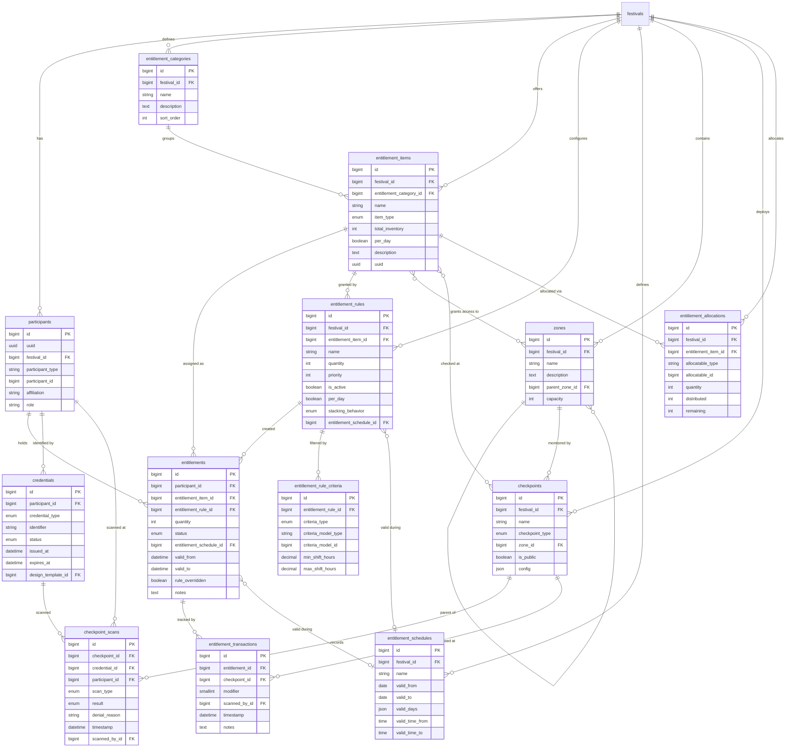

---

## 5. Item Type Behaviors (State Machines)

Each `item_type` on `EntitlementItem` determines the state machine for its Entitlements. All four types share the `assigned` initial state, but their lifecycles diverge from there.

### 5.1 Access Type

Access entitlements grant entry to zones. They have no quantity limit -- a person either has access or does not. Usage is tracked through checkpoint scans (in/out) but does not deplete the entitlement.

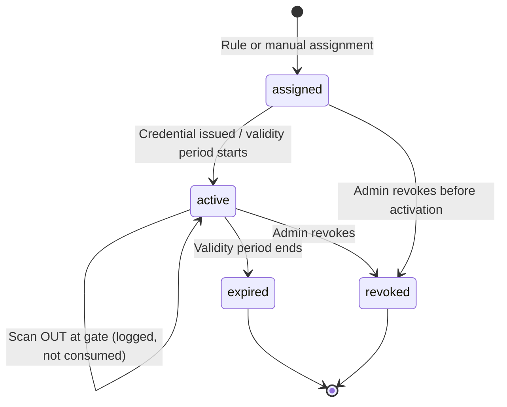

**Scanning behavior:** At a gate checkpoint, the system checks: (1) Does the participant have an active access entitlement? (2) Does that entitlement's item grant access to this gate's zone? (3) Is the current time within the entitlement's schedule? If all pass, scan is granted and logged as `access_in` or `access_out`.

**Examples:** AAA-Access Pass, Backstage Pass, Media Zone Access, VIP Wristband, Parking Pass.

### 5.2 Consumable Type

Consumable entitlements have a quantity that is decremented on each use. When depleted, no further scans are granted. Optional `per_day` flag resets the count each calendar day.

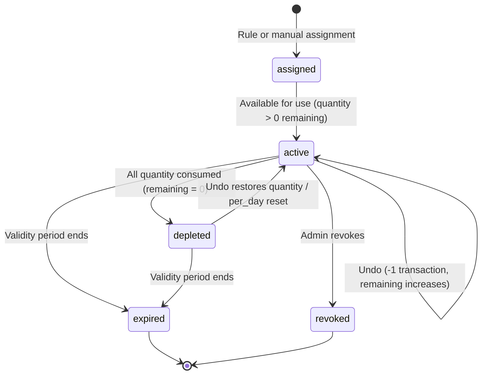

**Scanning behavior:** At a dispenser checkpoint, the system checks: (1) Does the participant have an active consumable entitlement for this item? (2) Is remaining quantity > 0? (For per_day items, compute remaining as `quantity - SUM(modifier) WHERE date = today`.) (3) Is the current time within the schedule? If all pass, create an EntitlementTransaction with modifier +1. The operator can undo within a configurable window (Lennd's undo pattern) by creating a -1 transaction.

**Examples:** Lunch Voucher (3/day), Drink Tokens (5 total), Fuel Voucher (2/day).

### 5.3 Returnable Type

Returnable entitlements track items that must be given back. They have a full check-out/check-in lifecycle and integrate with inventory tracking.

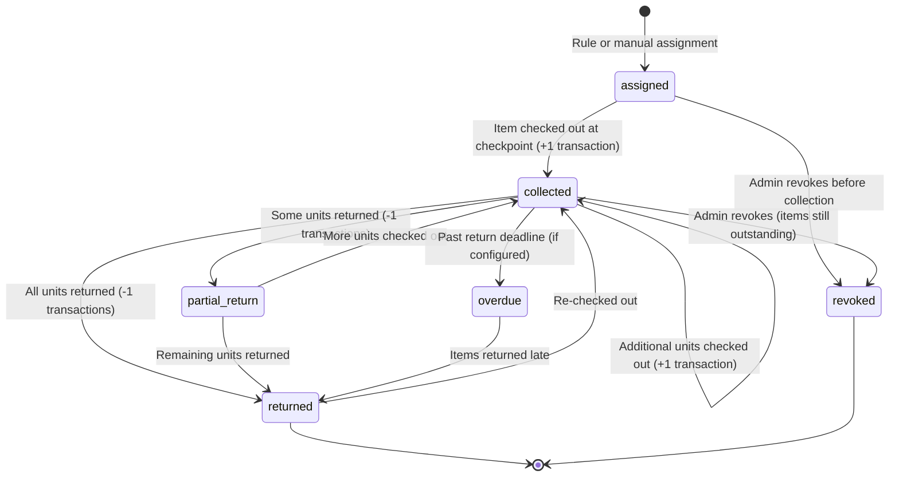

**Scanning behavior:** At a dispenser checkpoint configured for a returnable item, the system shows the participant's current state: how many assigned, how many out, how many returned. Scanning creates a +1 (checkout) or -1 (return) transaction. When an item has `total_inventory`, the system checks inventory availability before allowing checkout. Inventory available = `total_inventory - SUM(currently checked out across all participants)`.

**Examples:** Two-Way Radio, Headset, Laptop, Toolbox, Work Uniform.

### 5.4 One-Time Type

One-time entitlements are collected once and are then fully consumed. There is no quantity to track after collection.

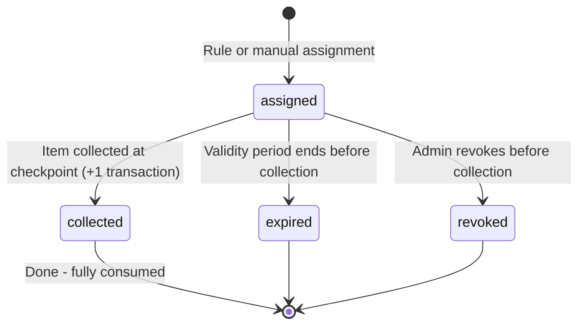

**Scanning behavior:** At a dispenser checkpoint, the system checks whether the participant has already collected this item (any +1 transaction exists). If not, it allows collection and records the transaction. If already collected, it shows "already collected" and denies.

**Examples:** Volunteer T-Shirt, Merchandise Bag, Welcome Kit, Festival Program, Sponsor Gift Bag.

### State Summary Table

| Status | Access | Consumable | Returnable | One-Time |
|---|---|---|---|---|
| `assigned` | Has access pass, not yet active | Has vouchers, not yet usable | Has item assignment, not yet picked up | Has item assignment, not yet picked up |
| `active` | Pass is active, can scan in/out | Vouchers available, quantity > 0 | -- | -- |
| `collected` | -- | -- | Items checked out, in participant's possession | Item picked up, done |
| `depleted` | -- | All quantity used up | -- | -- |
| `returned` | -- | -- | All items returned | -- |
| `expired` | Validity period ended | Validity period ended | -- | Validity period ended |
| `revoked` | Administratively cancelled | Administratively cancelled | Administratively cancelled | Administratively cancelled |

---

## 6. Rule Engine Design

The rule engine is the single largest competitive differentiator in this design. No event platform among the 11 researched has a true rule engine -- Accredit Solutions' Matrix comes closest with role-to-zone mapping, but it cannot express conditional logic like shift-hour-based meal allocation.

### 6.1 How Rules Work

A rule has three components:

1. **Criteria (WHO):** One or more `EntitlementRuleCriteria` records defining which participants the rule targets. Multiple criteria on the same rule use AND logic -- the participant must match all criteria.
2. **Item and Quantity (WHAT and HOW MUCH):** The `EntitlementItem` this rule grants, and how many (with optional `per_day`).
3. **Schedule (WHEN):** Optional `EntitlementSchedule` restricting the validity window of the resulting entitlements.

### 6.2 Criteria Evaluation

Each criteria type evaluates against the participant's relationships:

| Criteria Type | Matches When |
|---|---|
| `all_crew` | Participant's person is a User connected to the festival (crew or role) |
| `all_responders` | Participant's person is a PublicFormResponder |
| `all_festival_members` | Participant's person is a User OR PublicFormResponder |
| `all_travel_party` | Participant's person is a PartnerContact linked through a Performance |
| `all_guests` | Participant's person is a Guest on any guest list |
| `festival_section` | Participant is a User who is a member of the specified FestivalSection |
| `role` | Participant is a User with the specified role |
| `public_form` | Participant is a PublicFormResponder for the specified form |
| `shift_hours` | Participant has shift assignments within the specified hour range (evaluated per day for per_day rules) |

### 6.3 Rule Evaluation Flow

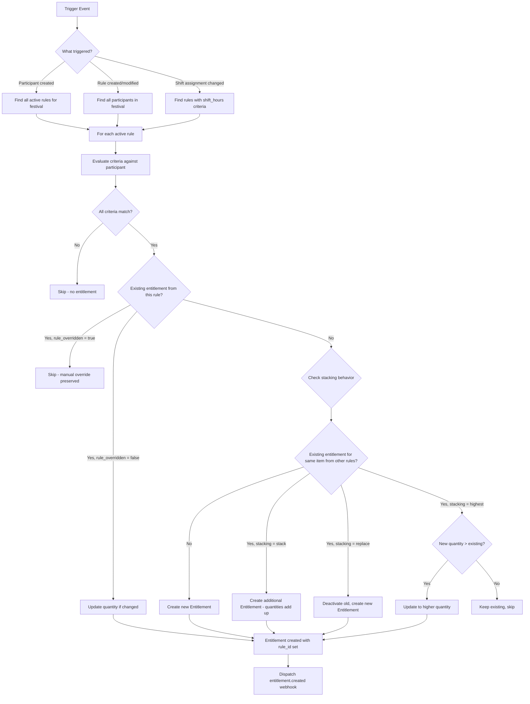

### 6.4 Trigger Events

Rules are evaluated when any of the following occur:

| Event | Action |
|---|---|
| **Participant created** | All active rules are evaluated for the new participant |
| **Rule created** | New rule is evaluated against all existing participants |
| **Rule modified** | Rule is re-evaluated; non-overridden entitlements are updated or removed |
| **Rule deactivated** | Entitlements created by this rule (not overridden) are revoked |
| **Shift assignment created/changed/deleted** | Rules with `shift_hours` criteria are re-evaluated for affected participants |
| **Festival section membership changed** | Rules with `festival_section` criteria are re-evaluated |
| **Public form response accepted** | Rules with `public_form` or `all_responders` criteria are re-evaluated |

### 6.5 Stacking Behavior in Detail

When multiple rules grant the same `EntitlementItem` to the same participant, the stacking behavior on each rule determines the outcome:

**Stack (additive):** Each rule creates its own Entitlement. The participant's effective quantity is the sum of all entitlements for that item. Use case: A volunteer who is both on Section A (gets 1 meal/day from rule 1) and has an 8-hour shift (gets 2 meals/day from rule 2) ends up with 3 meals/day.

**Replace (latest wins):** When a new rule fires, it deactivates any existing entitlement for the same item from other rules and creates its own. Use case: A "default access" rule grants general admission, but a "VIP upgrade" rule replaces it with VIP access.

**Highest (max quantity wins):** The system compares the new rule's quantity with existing entitlements for the same item and keeps only the highest. Use case: Multiple roles grant backstage access -- the participant should get backstage access once, not duplicated.

### 6.6 Shift-Hours Evaluation

The `shift_hours` criteria type is evaluated differently depending on the rule's `per_day` flag:

**Per-day rules:** For each day of the festival, the system computes the participant's total assigned shift hours on that day. If the total falls within `[min_shift_hours, max_shift_hours]`, the entitlement is granted for that day.

**Non-per-day rules:** The system computes the participant's total assigned shift hours across the entire festival. If the total falls within the range, the entitlement is granted.

**Tiered shift-hours rules:** Multiple rules with different hour ranges and quantities create a tiered system:

| Rule | Min Hours | Max Hours | Quantity | Result |
|---|---|---|---|---|
| "Short shift meal" | 4.0 | 5.99 | 1 | 1 meal for 4-6h shift |
| "Medium shift meal" | 6.0 | 7.99 | 2 | 2 meals for 6-8h shift |
| "Long shift meal" | 8.0 | null | 3 | 3 meals for 8h+ shift |

All three rules target the same item (Lunch Voucher) with stacking behavior `highest`. For a participant with an 8-hour shift, all three rules match, but `highest` stacking keeps only the quantity 3.

---

## 7. Key Workflows

### 7.1 Participant Onboarding

When a person is added to a festival -- whether a User joining crew, a PartnerContact added via a performance, a Guest added to a guest list, or a PublicFormResponder being accepted -- the onboarding flow creates their Participant record and evaluates all rules.

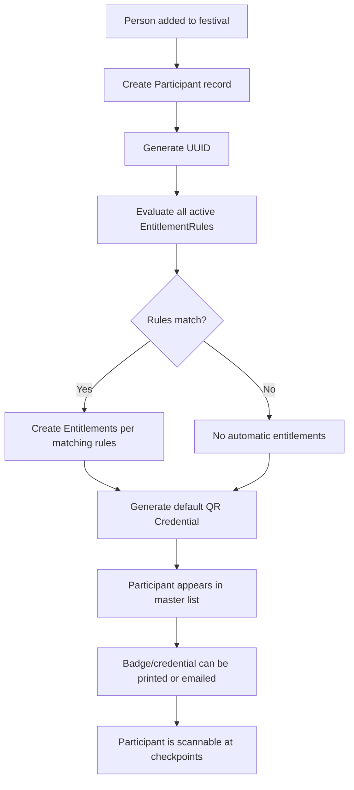

### 7.2 Meal Voucher Lifecycle

This workflow covers the most common consumable scenario: daily meal vouchers that are assigned by rule, scanned at food trucks, and reset each day.

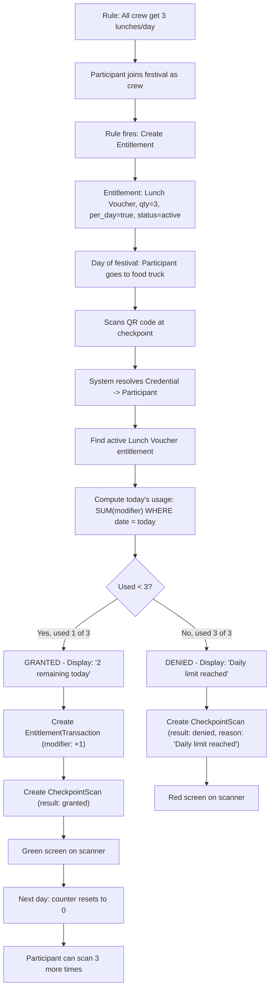

### 7.3 Equipment Check-Out and Return

This workflow covers the returnable item lifecycle using radios as the example. It includes inventory tracking.

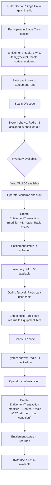

### 7.4 Access Control at Gate

This workflow shows the validation pipeline when a participant scans at a zone gate. It follows the validation sequence inspired by Accredit Solutions' 30+ result code pipeline.

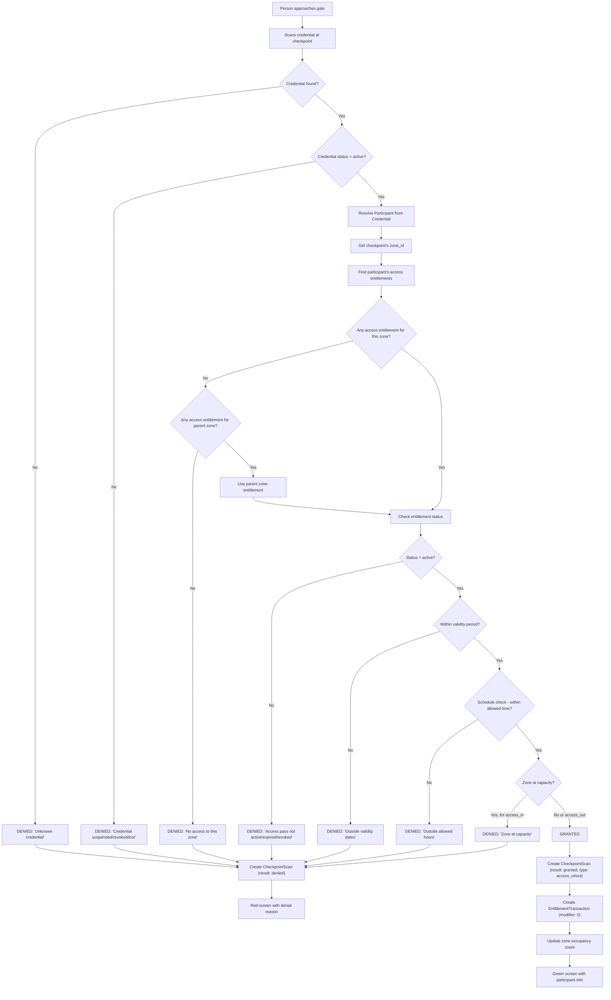

### 7.5 Group Allocation and Distribution

This workflow shows how a festival admin allocates entitlements to a group (e.g., a band/performance) and how those are distributed to individual participants.

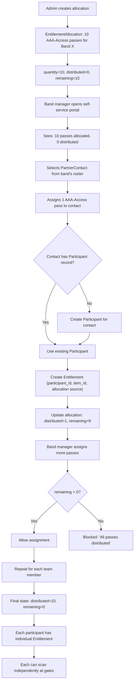

### 7.6 Shift-Based Meal Entitlement

This workflow demonstrates the unique shift-hours rule evaluation that no other system supports.

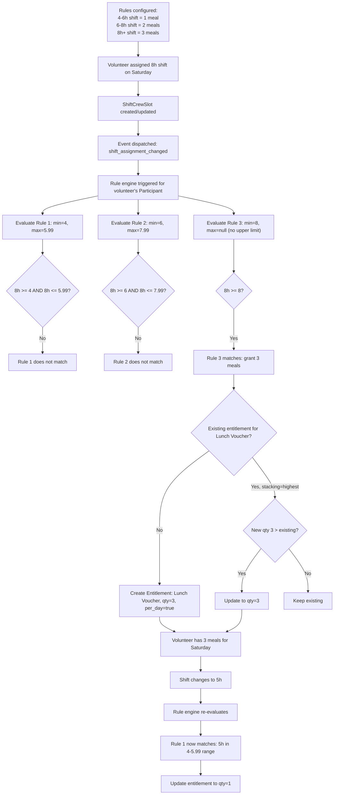

---

## 8. Scanning Architecture

### 8.1 Design Principles

The scanning system follows three principles derived from the best practices across all 11 researched systems:

1. **One scan, full context.** When a credential is scanned, the system resolves the participant and loads ALL active entitlements. The checkpoint configuration determines which items to display and process. This is FestivalPro's polymorphic eTicket approach -- one QR code, one scanner, all entitlement types.

2. **Checkpoint-configured behavior.** The same scanning app works at a gate, a food truck, and an equipment tent. The checkpoint's configuration (type, associated items, zone) determines what the scanner shows and what actions are available. No code changes for different use cases.

3. **Offline-first with sync.** Scanning must work without network connectivity. Pre-computed validation data is cached on the scanning device. Transactions queue locally and sync when connected.

### 8.2 Scan Resolution Pipeline

When a credential is scanned at any checkpoint:

```
1. RESOLVE     Identifier -> Credential -> Participant
2. LOAD        All active Entitlements for this Participant
3. FILTER      Keep only Entitlements matching this Checkpoint's configured items
4. EVALUATE    For each matching Entitlement, run the validation pipeline:
               a. Check entitlement status (active/assigned?)
               b. Check validity period (valid_from/valid_to)
               c. Check schedule (day of week, time of day)
               d. Check quantity remaining (for consumables)
               e. Check zone access (for access types)
               f. Check inventory (for returnables)
               g. Check zone capacity (for gates)
5. DISPLAY     Show results with color coding:
               GREEN  = all checks passed, action available
               RED    = one or more checks failed, with reason
               YELLOW = warning (e.g., "last meal of the day," "near capacity")
6. ACT         Operator confirms -> create Transaction + Scan records
```

### 8.3 Visual Feedback

Inspired by Arkon's color-coded scanning (green/yellow/red for shift check-in), every scan produces an immediate visual response:

| Color | Meaning | Examples |
|---|---|---|
| **Green** | Granted -- action successful | Access granted, meal dispensed, equipment checked out |
| **Red** | Denied -- action blocked | No access, daily limit reached, credential suspended |
| **Yellow** | Warning -- action succeeded with caveat | Last meal of the day, zone near capacity, equipment overdue |
| **Blue** | Information -- no action taken | Verification scan, participant details displayed |

The scan screen shows:
- Participant name, photo (if available), affiliation, and role
- For each configured item: status, remaining quantity, and action button
- Color-coded background for the primary result
- Timestamp and operator identification

### 8.4 Offline Mode

The offline scanning strategy combines approaches from three systems:

**From Accredit Solutions:** Pre-compute validation data and bulk-download to scanning devices. For each checkpoint, the system generates a validation bundle containing all participant-credential mappings, active entitlements for the checkpoint's configured items, zone permissions, and schedules.

**From FestivalPro:** Local server architecture. A Raspberry Pi or similar device at each scanning location maintains a local cache of the validation data and serves the scanning app. Scanners connect to the local server via WiFi, which syncs with the central system when internet is available.

**From Gallagher/Axess:** Transaction queuing. When offline, scans are validated against cached data and transactions are queued locally. On reconnection, transactions sync to the central database in chronological order. Conflict resolution uses timestamp-based ordering.

Offline data structure:

```json
{
  "checkpoint_id": 42,
  "generated_at": "2026-07-15T06:00:00Z",
  "valid_until": "2026-07-15T23:59:59Z",
  "participants": {
    "uuid-abc-123": {
      "name": "Jane Smith",
      "affiliation": "Stage Crew",
      "credentials": ["cred-identifier-1", "cred-identifier-2"],
      "entitlements": [
        {
          "item_uuid": "item-uuid-lunch",
          "item_name": "Lunch Voucher",
          "item_type": "consumable",
          "quantity": 3,
          "per_day": true,
          "used_today": 1,
          "schedule": null
        }
      ]
    }
  }
}
```

### 8.5 Hardware Support

| Medium | Support Level | Implementation |
|---|---|---|
| **QR Code** | Primary (v1) | Generated for all participants. Scanned via camera on mobile app or dedicated scanner. |
| **Badge/Printed** | Primary (v1) | QR code printed on badge. Same scanning mechanism. |
| **NFC/RFID** | Future (v2) | Wristband or card with NFC chip. Identifier stored on chip, scanned via NFC reader. Same resolution pipeline. |
| **Mobile Wallet** | Future (v2) | Apple Wallet / Google Wallet pass with embedded QR or NFC. |

---

## 9. API Design

The API follows RESTful conventions with JSON responses, token-based authentication, and pagination. All list endpoints support filtering and sorting. All mutation endpoints emit webhook events.

### 9.1 Resource Endpoints

#### Participants

| Method | Path | Description |
|---|---|---|
| `GET` | `/api/v1/festivals/{festival}/participants` | List all participants with filtering (type, section, role, entitlement status) |
| `POST` | `/api/v1/festivals/{festival}/participants` | Create participant (triggers rule evaluation) |
| `GET` | `/api/v1/festivals/{festival}/participants/{participant}` | Get participant with entitlements, credentials |
| `PATCH` | `/api/v1/festivals/{festival}/participants/{participant}` | Update participant (affiliation, role overrides) |
| `DELETE` | `/api/v1/festivals/{festival}/participants/{participant}` | Soft-delete participant, revoke entitlements |

#### Entitlement Items

| Method | Path | Description |
|---|---|---|
| `GET` | `/api/v1/festivals/{festival}/entitlement-items` | List all items with categories |
| `POST` | `/api/v1/festivals/{festival}/entitlement-items` | Create item |
| `GET` | `/api/v1/festivals/{festival}/entitlement-items/{item}` | Get item details with zone associations |
| `PATCH` | `/api/v1/festivals/{festival}/entitlement-items/{item}` | Update item |
| `DELETE` | `/api/v1/festivals/{festival}/entitlement-items/{item}` | Soft-delete item |

#### Entitlements

| Method | Path | Description |
|---|---|---|
| `GET` | `/api/v1/festivals/{festival}/entitlements` | List all entitlements with filtering |
| `POST` | `/api/v1/festivals/{festival}/entitlements` | Manually assign entitlement to participant |
| `POST` | `/api/v1/festivals/{festival}/entitlements/bulk` | Bulk assign entitlement to multiple participants |
| `GET` | `/api/v1/festivals/{festival}/entitlements/{entitlement}` | Get entitlement with transactions |
| `PATCH` | `/api/v1/festivals/{festival}/entitlements/{entitlement}` | Update entitlement (sets rule_overridden=true if rule-created) |
| `DELETE` | `/api/v1/festivals/{festival}/entitlements/{entitlement}` | Revoke entitlement |

#### Rules

| Method | Path | Description |
|---|---|---|
| `GET` | `/api/v1/festivals/{festival}/entitlement-rules` | List all rules |
| `POST` | `/api/v1/festivals/{festival}/entitlement-rules` | Create rule (triggers evaluation for all participants) |
| `GET` | `/api/v1/festivals/{festival}/entitlement-rules/{rule}` | Get rule with criteria |
| `PATCH` | `/api/v1/festivals/{festival}/entitlement-rules/{rule}` | Update rule (triggers re-evaluation) |
| `DELETE` | `/api/v1/festivals/{festival}/entitlement-rules/{rule}` | Delete rule (revokes non-overridden entitlements) |
| `POST` | `/api/v1/festivals/{festival}/entitlement-rules/{rule}/evaluate` | Manually trigger rule evaluation |

#### Checkpoints and Scanning

| Method | Path | Description |
|---|---|---|
| `GET` | `/api/v1/festivals/{festival}/checkpoints` | List all checkpoints |
| `POST` | `/api/v1/festivals/{festival}/checkpoints` | Create checkpoint |
| `PATCH` | `/api/v1/festivals/{festival}/checkpoints/{checkpoint}` | Update checkpoint configuration |
| `POST` | `/api/v1/festivals/{festival}/checkpoints/{checkpoint}/scan` | Process a scan (the core scanning endpoint) |
| `GET` | `/api/v1/festivals/{festival}/checkpoints/{checkpoint}/offline-bundle` | Download pre-computed offline validation data |
| `POST` | `/api/v1/festivals/{festival}/checkpoints/{checkpoint}/sync` | Upload queued offline transactions |

#### Credentials

| Method | Path | Description |
|---|---|---|
| `GET` | `/api/v1/festivals/{festival}/credentials` | List all credentials |
| `POST` | `/api/v1/festivals/{festival}/credentials` | Issue new credential for participant |
| `PATCH` | `/api/v1/festivals/{festival}/credentials/{credential}` | Update status (suspend, revoke, mark lost) |
| `POST` | `/api/v1/festivals/{festival}/credentials/{credential}/replace` | Issue replacement credential (revokes old) |

#### Allocations

| Method | Path | Description |
|---|---|---|
| `GET` | `/api/v1/festivals/{festival}/allocations` | List all group allocations |
| `POST` | `/api/v1/festivals/{festival}/allocations` | Create allocation for group |
| `PATCH` | `/api/v1/festivals/{festival}/allocations/{allocation}` | Update allocation quantity |
| `POST` | `/api/v1/festivals/{festival}/allocations/{allocation}/distribute` | Assign from allocation to individual participant |

#### Zones

| Method | Path | Description |
|---|---|---|
| `GET` | `/api/v1/festivals/{festival}/zones` | List zones (tree structure) |
| `POST` | `/api/v1/festivals/{festival}/zones` | Create zone |
| `PATCH` | `/api/v1/festivals/{festival}/zones/{zone}` | Update zone |
| `GET` | `/api/v1/festivals/{festival}/zones/{zone}/occupancy` | Current occupancy count |

### 9.2 Scan Endpoint Detail

The `POST /checkpoints/{checkpoint}/scan` endpoint is the most critical in the system.

**Request:**

```json
{
  "identifier": "cred-uuid-or-barcode",
  "action": "auto",
  "items": null,
  "quantity": 1,
  "notes": null
}
```

- `identifier`: The credential identifier (from QR code, NFC read, or manual entry)
- `action`: `auto` (checkpoint determines), `access_in`, `access_out`, `dispense`, `return`, `verify`
- `items`: Optional array of specific item IDs to process. If null, checkpoint config determines.
- `quantity`: How many to dispense/return (default 1). Allows "give 3 meals at once" for group collection.
- `notes`: Optional transaction notes.

**Response:**

```json
{
  "result": "granted",
  "participant": {
    "id": 456,
    "uuid": "abc-123",
    "name": "Jane Smith",
    "affiliation": "Stage Crew",
    "role": "Sound Engineer",
    "photo_url": "https://..."
  },
  "items": [
    {
      "entitlement_item_id": 12,
      "name": "Lunch Voucher",
      "item_type": "consumable",
      "result": "granted",
      "remaining": 2,
      "message": "2 of 3 remaining today",
      "transaction_id": 789
    },
    {
      "entitlement_item_id": 5,
      "name": "Backstage Access",
      "item_type": "access",
      "result": "granted",
      "message": "Access valid until 2026-07-17",
      "transaction_id": 790
    }
  ],
  "scan_id": 1234,
  "timestamp": "2026-07-15T12:34:56Z"
}
```

### 9.3 Webhook Events

All lifecycle events emit webhooks to configured endpoints:

| Event | Payload | Triggered When |
|---|---|---|
| `participant.created` | Participant data | New participant added |
| `participant.deleted` | Participant ID | Participant removed |
| `entitlement.assigned` | Entitlement + participant | New entitlement created (manual or rule) |
| `entitlement.collected` | Entitlement + transaction | Item collected/checked out |
| `entitlement.depleted` | Entitlement + participant | Consumable fully used |
| `entitlement.returned` | Entitlement + transaction | Returnable item returned |
| `entitlement.revoked` | Entitlement + reason | Entitlement administratively revoked |
| `credential.issued` | Credential + participant | New credential created |
| `credential.suspended` | Credential + reason | Credential suspended |
| `credential.revoked` | Credential + reason | Credential permanently revoked |
| `scan.granted` | Scan details | Successful scan |
| `scan.denied` | Scan details + reason | Denied scan |
| `rule.evaluated` | Rule + affected count | Rule evaluation completed |
| `allocation.distributed` | Allocation + participant | Item distributed from group allocation |

---

## 10. Migration Strategy

### 10.1 Data Mapping

The migration from the current accreditation system to the new entitlement system preserves all existing data while enriching it.

| Current Entity | New Entity | Mapping |
|---|---|---|
| **AccreditationLevel** | **EntitlementItem** | Each level becomes an item with `item_type: access`. Level name maps to item name. Level hierarchy maps to zone associations. |
| **Accreditation** (polymorphic) | **Participant** + **Entitlement** | The polymorphic person reference (person_type/id) maps to participant_type/id. The festival_id carries over. An Entitlement is created with the access item corresponding to the old AccreditationLevel. |
| `accreditation.collected_at` | **EntitlementTransaction** | A transaction with modifier 0 and the original collected_at timestamp. Also sets Entitlement status to `active`. |
| `accreditation.approved_by` | **Entitlement.notes** | Preserved in the notes field as "Originally approved by: [user]". |
| **AccreditationList** (if applicable) | **EntitlementRule** | List criteria map to rule criteria. The accreditation level maps to the rule's item. |

### 10.2 Migration Sequence

```
Phase 1: Schema creation
  - Run migrations to create all new tables
  - No data changes to existing tables

Phase 2: Data migration (non-destructive)
  - Create EntitlementCategories ("Accreditations" as default)
  - Create EntitlementItems from AccreditationLevels
  - Create Zone records and entitlement_item_zone associations
  - Create Participants from existing Accreditation person references
  - Create Entitlements from existing Accreditations
  - Create Credentials (QR) for all Participants
  - Create EntitlementTransactions for collected_at records
  - Verify counts: accreditations count = entitlements count

Phase 3: Parallel operation
  - New entitlement system runs alongside old accreditation
  - New scans write to both systems
  - Validate consistency

Phase 4: Cutover
  - Switch all reads to new system
  - Disable old accreditation endpoints
  - Mark old tables as deprecated

Phase 5: Cleanup
  - Remove old accreditation code
  - Archive old tables
```

### 10.3 Migration Estimate

Based on Crescat's original estimate of 5 hours for data migration, the expanded scope adds:

| Task | Estimate |
|---|---|
| Schema migrations (new tables) | 4 hours |
| Data migration scripts | 8 hours |
| Verification and testing | 4 hours |
| Parallel operation monitoring | 4 hours |
| **Total migration** | **20 hours** |

This does not include building the new features (rule engine, scanning, etc.) -- only the migration of existing data into the new schema.

---

## 11. What This Enables

This section maps every scenario from Crescat's original entitlement planning document to the new architecture, showing how each is solved.

### 11.1 Volunteer Scenarios

> **"I want to give all volunteers 1 meal per day"**

Create an EntitlementRule:
- Criteria: `criteria_type = all_crew`
- Item: Lunch Voucher (`item_type: consumable`)
- Quantity: 1
- Per-day: true
- Stacking: `highest`

Every User connected to the festival gets 1 Lunch Voucher per day automatically.

---

> **"I want to give all volunteers with a shift assigned 1 meal per day they are working"**

Create an EntitlementRule:
- Criteria: `criteria_type = shift_hours`, `min_shift_hours = 0.01`, `max_shift_hours = null`
- Item: Lunch Voucher
- Quantity: 1
- Per-day: true

Only participants with at least some shift hours on a given day receive the meal for that day.

---

> **"I want to give all volunteers one meal per 6 hours of shift"**

Create an EntitlementRule:
- Criteria: `criteria_type = shift_hours`, `min_shift_hours = 6`, `max_shift_hours = null`
- Item: Lunch Voucher
- Quantity: 1
- Per-day: true
- Stacking: `stack`

A participant with a 12-hour shift day would match this rule. For "per 6 hours" semantics, the rule engine computes `floor(total_hours / 6)` as the quantity. This is a special case handled in the shift-hours evaluation logic: when a rule has `shift_hours` criteria and `per_day = true`, the granted quantity is `floor(daily_shift_hours / min_shift_hours) * rule_quantity`.

---

> **"I want to give all volunteers one meal for a 4-hour shift, 2 meals for a 6-hour shift, and 3 meals for a 10-hour shift"**

Create three EntitlementRules, all for Lunch Voucher, all with stacking = `highest`:
1. Criteria: `shift_hours` min=4, max=5.99, Quantity: 1
2. Criteria: `shift_hours` min=6, max=9.99, Quantity: 2
3. Criteria: `shift_hours` min=10, max=null, Quantity: 3

The `highest` stacking behavior ensures only the appropriate tier applies.

---

> **"I want to give all volunteers one free festival pass once they have a shift assigned"**

Create an EntitlementRule:
- Criteria: `criteria_type = shift_hours`, `min_shift_hours = 0.01`
- Item: Festival Pass (`item_type: access`)
- Quantity: null (unlimited access)

Any volunteer with any shift gets a festival access pass.

---

> **"I want to give all volunteers a bag of merchandise"**

Create an EntitlementRule:
- Criteria: `criteria_type = all_crew`
- Item: Merchandise Bag (`item_type: one_time`)
- Quantity: 1

Every volunteer gets one merchandise bag, collectible once at a dispenser checkpoint.

---

> **"I want to give every volunteer on a particular festival section a radio for every day they have a shift which should be returned"**

Create an EntitlementRule:
- Criteria: `criteria_type = festival_section`, `criteria_model_id = [section_id]` AND `criteria_type = shift_hours`, `min_shift_hours = 0.01`
- Item: Two-Way Radio (`item_type: returnable`, `total_inventory: 50`)
- Quantity: 1
- Per-day: true

Volunteers in the specified section with shifts get a radio assignment for each day they work. The returnable lifecycle tracks checkout and return. Inventory prevents over-allocation.

---

> **"I want to give every volunteer on a particular festival section a radio for the festival period which should be returned at the end"**

Create an EntitlementRule:
- Criteria: `criteria_type = festival_section`, `criteria_model_id = [section_id]`
- Item: Two-Way Radio (`item_type: returnable`, `total_inventory: 50`)
- Quantity: 1
- Per-day: false

One radio for the entire festival period. Return expected at festival end.

---

### 11.2 Group/Performance Scenarios

> **"Give Band X 10 all-access passes for their crew to distribute"**

Create an EntitlementAllocation:
- Item: AAA-Access Pass (`item_type: access`)
- Allocatable: Performance (Band X)
- Quantity: 10

Band X's tour manager uses the self-service portal to distribute passes to individual crew members, who become Participants with individual Entitlements.

---

> **"Can one person collect meals for an entire band?"**

At a dispenser checkpoint, the operator scans the collector's credential and can process multiple dispenses using the `quantity` field in the scan request. The scan API supports `quantity: 3` to dispense 3 meals in one scan. Each dispense creates a transaction. The display shows the updated remaining count.

---

### 11.3 Item Type Scenarios

> **"Parking accreditation/allocation"**

Create an EntitlementItem:
- Name: "Parking Pass"
- Item type: `access`
- Category: "Accreditations"
- Zone association: "Parking Area" zone

Assign via rule or manually. Scanned at parking gate checkpoint. Works identically to backstage access but for a different zone.

---

> **"Giving out attire / work tools"**

Create EntitlementItems:
- "Volunteer T-Shirt (M)" - `item_type: one_time` (collected once, kept)
- "Work Pen Set" - `item_type: one_time` (collected once, kept)
- "Towel Bundle" - `item_type: consumable` (given daily, not returned)

Each has appropriate rules for automatic assignment.

---

> **"Can we add multiple accreditations from Crescat into one physical wristband?"**

Yes. A single Credential (type: `wristband`) links to a Participant. The Participant can have multiple Entitlements across different items and categories. When the wristband is scanned, the system resolves to the Participant and evaluates ALL entitlements. This is the Axess chip segmentation concept -- multiple authorizations on one physical medium -- implemented through the person-centric architecture where entitlements belong to the Participant, not the credential.

---

### 11.4 Scanning and Portal Scenarios

> **"FestivalPortal with scannable pivot for items, categories, and accreditation levels"**

A Checkpoint configured as type `scanner` with `is_public = true` (or specific user pivot). The checkpoint's `checkpoint_entitlement_items` pivot determines which items are scannable. The checkpoint's `config` JSON can specify display options (show shifts, show accreditations, etc.). This maps directly to Crescat's FestivalPortal concept with the FestivalPortalScannablePivot replaced by the checkpoint_entitlement_items pivot.

---

### 11.5 Stacking and Override Scenarios

> **"Make support for the option to choose on an item basis if it stacks or not when added to an entity by the same rule"**

The `stacking_behavior` enum on EntitlementRule handles this. The three options (`stack`, `replace`, `highest`) cover all cases. When the same rule applies to a participant multiple times (e.g., through multiple festival sections), the rule engine applies the stacking behavior to determine the final quantity.

---

> **"If multiple affiliations give the same concept, what to do?"**

Handled by the stacking behavior configuration:
- Same rule matches multiple times: rule creates one entitlement (deduplicated by rule_id + participant_id)
- Different rules grant same item: stacking_behavior determines outcome (stack adds quantities, highest keeps max, replace uses latest)

---

### 11.6 Summary: Feature Coverage

| Scenario Category | Covered | Mechanism |
|---|---|---|
| Access passes (zone-based) | Yes | EntitlementItem type: access + zones |
| Meal vouchers (daily limit) | Yes | EntitlementItem type: consumable, per_day: true |
| Equipment loans (returnable) | Yes | EntitlementItem type: returnable + inventory |
| Merchandise/perks (one-time) | Yes | EntitlementItem type: one_time |
| Rule-based auto-assignment | Yes | EntitlementRule with criteria |
| Shift-hours-based rules | Yes | criteria_type: shift_hours with ranges |
| Manual override preservation | Yes | rule_overridden flag |
| Stacking/deduplication | Yes | stacking_behavior per rule |
| Group allocation + delegation | Yes | EntitlementAllocation model |
| Multi-purpose scanning | Yes | Checkpoint with configured items |
| Offline scanning | Yes | Pre-computed validation bundles |
| Time-windowed validity | Yes | EntitlementSchedule |
| Zone hierarchy | Yes | zones.parent_zone_id |
| Zone capacity tracking | Yes | Directional scanning + zone capacity |
| Credential replacement | Yes | Credential status lifecycle |
| Audit trail | Yes | EntitlementTransactions + CheckpointScans |
| Bulk collection | Yes | Scan API quantity parameter |
| Multiple entitlements per credential | Yes | Person-centric, not credential-centric |
| Undo/correction | Yes | Transaction modifier -1 |
| API + webhooks | Yes | Full REST API + webhook events |

---

## Appendix A: Table Count and Relationship Summary

| Table | Relationships | Purpose |
|---|---|---|
| `participants` | Central junction | Person-to-festival link |
| `entitlement_categories` | Groups items | UI organization |
| `entitlement_items` | Defines things to give | Catalog of entitlements |
| `entitlements` | Participant-to-item link | The core assignment |
| `entitlement_transactions` | Entitlement audit | Usage tracking |
| `entitlement_rules` | Automation | Auto-assignment logic |
| `entitlement_rule_criteria` | Rule conditions | Who a rule targets |
| `entitlement_schedules` | Time windows | When things are valid |
| `zones` | Physical areas | Access control geography |
| `entitlement_item_zone` | Item-to-zone pivot | Which items open which doors |
| `credentials` | Scannable tokens | Physical/digital identifiers |
| `checkpoints` | Scanning stations | Where scanning happens |
| `checkpoint_entitlement_items` | Checkpoint config pivot | What each scanner checks |
| `checkpoint_scans` | Scan audit | Every scan logged |
| `entitlement_allocations` | Group distribution | Bulk allocation to groups |

**Total new tables: 15** (including 2 pivot tables)

---

## Appendix B: Provenance -- What Came from Where

This table maps each architectural decision to the researched system that inspired it, providing traceability for the "best of all worlds" synthesis.

| Design Decision | Primary Inspiration | Supporting Systems |
|---|---|---|
| Participant as person-event junction | Accredit Solutions (Registration) | Gallagher (Cardholder), all person-centric systems |
| Polymorphic participant types | Crescat existing pattern | Accredit (Contact + multiple Registrations) |
| Unified entitlement model with item_type | Arkon (Tilvalg polymorphic add-on) | FestivalPro (polymorphic eTicket) |
| Four item types (access/consumable/returnable/one_time) | Final Report recommendation | Synthesized from all 11 systems |
| Rule engine with criteria | Accredit Solutions (Matrix) | Gallagher (Access Groups), Envoy (conditional rules) |
| Stacking behavior configuration | Gallagher (additive Access Groups) | Eventree (one per category dedup) |
| Shift-hours criteria | Novel (no system implements this) | Crescat's original requirement |
| Transaction modifier (+1/-1/0) | Arkon (bonger scan model) | Lennd (undo capability) |
| Schedule/temporal layering | Gallagher (Schedule + Day Category) | Accredit (zone time parameters) |
| Zone hierarchy | Gallagher (Access Zone) | Eventree (Area > Sub-area) |
| Credential separate from entitlements | Gallagher (Card vs Access Group) | Accredit (Badge vs Badge Access) |
| Multi-purpose scanning | FestivalPro (polymorphic eTicket) | Arkon (multi-purpose QR) |
| Offline scanning bundles | Accredit Solutions (bulk download) | FestivalPro (Raspberry Pi), Axess (controller cache) |
| Color-coded scan feedback | Arkon (green/yellow/red shifts) | Universal UX pattern |
| Group allocation + delegation | Lennd (Allocation + Guest List) | Axess (Flex Days shared pool) |
| Directional scanning (in/out) | CoreGo (directional scanning) | Gallagher (zone counting) |
| Checkpoint configuration pivot | FestivalPro (scanner configuration) | Accredit (Area-based scanning) |
| Webhook events | Accredit Solutions (webhook API) | Envoy (webhook-driven integration) |
| rule_overridden flag | Crescat original concept | Accredit (manual override of Matrix defaults) |
| Inventory tracking for returnables | Novel (no system does this well) | Eventree (resource module, partial) |

---

## Appendix C: What This Does NOT Cover

The following are explicitly out of scope for this proposal and should be addressed in separate specifications:

1. **Badge/credential visual design system** -- Template builder, CSS customization (see Envoy's CSS badge pattern)
2. **Self-service portals for group leaders** -- The delegation UI for distributing allocations (see Lennd and Weezevent patterns)
3. **Notification system** -- Email/SMS notifications for entitlement assignment, reminders, and credential delivery
4. **Reporting and analytics** -- Dashboards for occupancy, consumption rates, scan activity, rule effectiveness
5. **Induction/onboarding gates** -- Pre-entry requirements like safety briefings (see Eventree's induction-gated entry)
6. **Payment integration** -- Cashless payment via NFC (see Weezevent/CoreGo patterns)
7. **Cross-festival person persistence** -- Reusing participant data across festivals (see Weezevent Community, OppSport season accreditation)
8. **Vehicle access passes** -- Vehicle credential management (see Accredit Solutions VAAP)
9. **Anti-passback and mantrap logic** -- Preventing credential sharing (see Gallagher interlocks)
10. **Fatigue/shift compliance** -- Regulated zone tracking (see Gallagher Regulated Zones)
